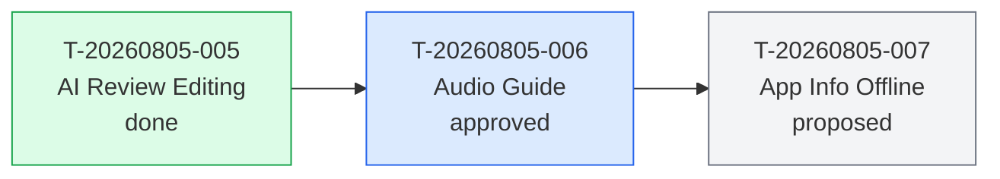
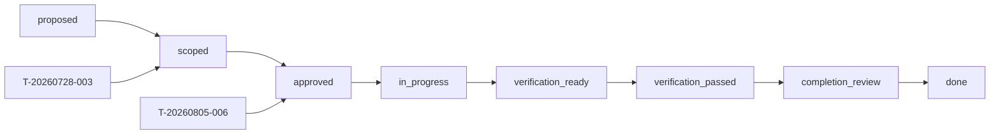
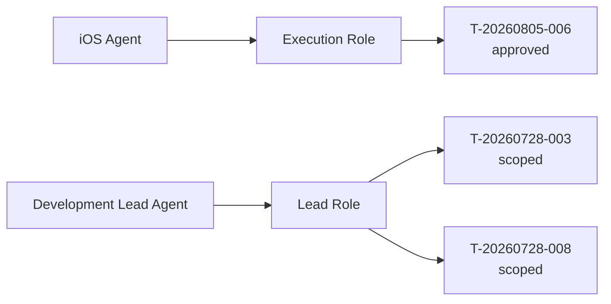

# Project Dashboard Upgrade Plan

상태: 6차 Risk/Agent/Release View 구현 완료, 7차 HTML / Static Dashboard 재검토 대기
대상: 5차 policy evaluation / project snapshot / action plan 계약 이후
담당: AI Ops 운영자

이 문서는 AI Ops의 사용자용 dashboard / work map 구현 계획이다.

기존 시각화 메모는 "monitor" 중심이었지만, 실제 목표는 단순 상태 요약보다 넓다. 사용자는 프로젝트 설정, 진행률, 활성 일감, Agent/Role 담당, Task 의존성, workflow 흐름, blocker/warning을 한 화면 또는 관계도로 보고 싶다.

## 목표

AI Ops Dashboard는 아래 질문에 답해야 한다.

- 이 프로젝트는 지금 어떤 운영 설정으로 돌아가고 있는가?
- 전체 진행률은 어느 정도인가?
- 현재 활성화된 일감은 무엇인가?
- 각 일감의 상태, 담당 Role, 담당 Agent는 무엇인가?
- 어떤 Task가 어떤 Task에 의존하는가?
- workflow 상 각 Task는 어디에 위치하는가?
- 어떤 blocker/warning/drift가 작업을 막거나 지연시키는가?
- 다음에 열어야 할 Role Session 또는 실행할 안전한 명령은 무엇인가?

## 핵심 명령

초기 명령은 `project` 하위로 둔다. 기존 `project health`, `project snapshot`, `project context`와 같은 계열이기 때문이다.

```sh
aiops project dashboard
aiops project dashboard --view main
aiops project dashboard --view work
aiops project dashboard --view work --level detail
aiops project dashboard --view work --format tree
aiops project dashboard --view work --format mermaid --map dependencies
aiops project dashboard --view work --format mermaid --map workflow
aiops project dashboard --view work --format mermaid --map agents
aiops project dashboard --json
```

## 데이터 원천

Dashboard는 source of truth가 아니다. 새 판단 로직을 독자적으로 만들지 않고, 이미 안정화된 상태 계약을 읽어 projection으로 표시한다.

허용 흐름:

```text
.ai_project / Git / workflow catalog / policy rules
-> project snapshot
-> project health
-> policy evaluation
-> action plan
-> project dashboard
```

금지 흐름:

```text
dashboard가 Markdown 원문을 직접 파싱해 별도 판단
dashboard 결과를 운영 문서처럼 수동 수정
dashboard가 health/snapshot/policy와 다른 blocker 의미 사용
.ai_project/.runtime/status_ref를 commit 대상으로 안내
```

## View 구조

### 1. Main Dashboard

프로젝트 운영 현황과 전체 진행률을 보여주는 기본 화면이다.

기본 명령:

```sh
aiops project dashboard
aiops project dashboard --view main
```

표시 항목:

- project name
- overall status
- blockers / warnings
- bootstrap readiness
- task work readiness
- multi-agent readiness
- migration status
- operating mode
- workflow policy
- knowledge mode
- core version / recorded core version
- canonical status sync
- total / active / done / proposed / scoped / approved Task 수
- 진행률
- active / deferred Agent 수
- active Role 목록
- 주요 risk / drift
- next commands

예상 출력:

```text
AI Ops Dashboard
Project: CookLog
Status: WARNING    Blockers: 0    Warnings: 3

Progress
[#####################---------] 47 / 68 done
Active: 20    Proposed: 17    Scoped: 2    Approved: 1

Operations
Bootstrap: complete
Task Work: allowed_with_warnings
Multi-agent: ready
Migration: not_required
Canonical Sync: recorded_current

Agents
Active: 12    Deferred: 1
Roles: Direction, Lead, Execution, Verification, Completion, Ops

Warnings
- task_metadata_incomplete: 18 task(s)
- task_status_ref_missing: 20 active task(s)
- unresolved_decisions_present: 7 marker(s)

Next
- aiops validate project --strict
- aiops project dashboard --view work
```

### 2. Work Dashboard

현재 일감의 상태, 담당, 의존성, workflow 위치를 보여주는 작업 화면이다.

기본 명령:

```sh
aiops project dashboard --view work
```

표시 항목:

- active / scoped / approved / in_progress / verification_ready / completion_review Task
- status
- workflow
- target Role
- target Agent
- lock 상태
- branch / worktree
- status_ref 상태
- depends_on / blocks
- report_to / qa_to / handoff 후보
- allowed_paths 요약
- source_of_truth 요약
- 다음 Role Session 추천

간단 출력:

```text
Active Work

Task              Status      Role        Agent       Next
T-20260805-006    approved    Execution   iOS Agent   start execution
T-20260728-003    scoped      Lead        Dev Lead    approve or split
T-20260728-008    scoped      Lead        Dev Lead    approve or split
```

상세 출력:

```text
T-20260805-006 iOS Audio Guide
Status: approved
Workflow: feature
Role: Execution Role
Agent: iOS Agent
Lock: none
Branch: unresolved
Worktree: unresolved

Allowed Paths
- apps/ios/CookLog/Features/AudioPlayer/
- apps/ios/CookLog/Services/AudioGuide/

Source of Truth
- design/COOKLOG_MVP_UIUX_V1_HANDOFF.md
- apps/ios/docs/SERVICES.md

Next
- aiops role prompt execution --task T-20260805-006
```

### 3. Risk Dashboard

처음에는 Main Dashboard 안의 섹션으로 제공한다. 필요하면 별도 view로 분리한다.

후보 명령:

```sh
aiops project dashboard --view risk
```

표시 항목:

- blocker
- warning
- policy matched rules
- adapter drift
- runtime cache tracked 상태
- stale canonical status
- unresolved decisions
- task metadata incomplete
- status_ref missing
- approval-required actions

### 4. Agent Dashboard

초기에는 Main/Work Dashboard에 요약만 포함한다. 필요하면 별도 view로 분리한다.

후보 명령:

```sh
aiops project dashboard --view agents
```

표시 항목:

- Agent
- status enabled/deferred
- team
- declared roles
- capabilities
- current task
- branch/worktree
- drift

### 5. Release / Readiness Dashboard

초기에는 Main Dashboard의 readiness와 release-check로 대체한다. 이후 릴리즈 운영이 늘어나면 별도 view로 분리한다.

후보 명령:

```sh
aiops project dashboard --view release
```

표시 항목:

- release blockers
- pending checks
- required approvals
- migration 상태
- policy blockers
- unresolved release decisions

## 출력 형식

### Terminal

기본 출력이다. 색상을 지원하되, 색상이 없어도 읽히는 텍스트 구조를 우선한다.

```sh
aiops project dashboard --format terminal
```

색상 원칙:

- green: ready / done / no blocker
- yellow: warning / review needed
- red: blocker / blocked
- blue: active / current focus
- gray: deferred / proposed / unresolved

CI나 로그 환경을 위해 색상 비활성 옵션을 둔다.

```sh
aiops project dashboard --no-color
```

### Tree

일감 구조를 빠르게 훑기 위한 출력이다.

```sh
aiops project dashboard --view work --format tree
```

예상 출력:

```text
Work Tree
├─ approved
│  └─ T-20260805-006 Audio Guide
│     ├─ Role: Execution
│     ├─ Agent: iOS Agent
│     └─ Next: role prompt execution
├─ scoped
│  ├─ T-20260728-003 Apply Figma UIUX
│  └─ T-20260728-008 iOS CI Pipeline
└─ proposed
   ├─ T-20260805-007 App Info Offline
   └─ T-20260805-008 Accessibility Regression
```

### Mermaid

의존성, workflow, Agent 관계를 문서/PR/README에 붙일 수 있게 출력한다.

```sh
aiops project dashboard --view work --format mermaid --map dependencies
aiops project dashboard --view work --format mermaid --map workflow
aiops project dashboard --view work --format mermaid --map agents
aiops project dashboard --view work --format mermaid --map blockers
```

Dependency map:



Workflow map:



Agent map:



### JSON

HTML dashboard, 외부 adapter, 테스트가 읽는 기계 계약이다.

```sh
aiops project dashboard --json
```

후보 구조:

```json
{
  "schema": "aiops.project_dashboard.v1",
  "target": "/path/to/project",
  "view": "main",
  "level": "standard",
  "status": {
    "overall": "warning",
    "blockers": 0,
    "warnings": 3
  },
  "progress": {
    "total_tasks": 68,
    "done_tasks": 47,
    "active_tasks": 20,
    "done_ratio": 0.69
  },
  "readiness": {
    "bootstrap": "complete",
    "task_work": "allowed_with_warnings",
    "multi_agent": "ready",
    "migration": "not_required"
  },
  "git": {
    "branch": "develop",
    "head": "5307f13",
    "canonical_status_ref": "origin/develop",
    "status_ref_state": "recorded_current"
  },
  "agents": {
    "active": 12,
    "deferred": 1,
    "roles": []
  },
  "tasks": {
    "by_status": {},
    "items": []
  },
  "risks": {
    "blockers": [],
    "warnings": []
  },
  "next": []
}
```

초기 구현에서는 schema 파일을 바로 만들지 않을 수 있다. release 대상으로 안정화할 때 `schemas/project_dashboard.schema.json`을 추가한다.

## 표시 레벨

Dashboard는 정보량을 선택할 수 있어야 한다.

```sh
--level compact
--level standard
--level detail
```

### compact

한 화면 요약이다.

- overall
- progress
- blockers/warnings count
- readiness
- active work count
- next 1~3개

### standard

기본값이다.

- compact 항목
- Task status summary
- active Agent/Role summary
- 주요 warnings
- 추천 Role Session

### detail

검증/완료/운영 점검용이다.

- standard 항목
- Task별 allowed_paths
- source_of_truth
- status_ref / base_ref
- policy evidence
- handoff/report/qa path
- Agent capability
- drift evidence

## 단계별 구현 계획

### 1차. Dashboard Plan Consolidation

목표:

- 시각화 관련 계획을 하나의 문서로 통합
- `monitor`보다 넓은 dashboard/work map 방향 확정

작업:

- `design_notes/project_dashboard_upgrade_plan.md` 작성
- 기존 시각화 메모 폐기 또는 참조 정리
- control/policy 계획의 시각화 참조를 새 문서로 연결

검증:

- 문서가 Main Dashboard / Work Dashboard / output format / level / phase를 모두 포함
- 이전 시각화 메모 파일명으로 남은 외부 참조 없음
- `git diff --check` 통과

### 2차. Main Dashboard Terminal

목표:

- `aiops project dashboard` 기본 화면 구현
- project health/snapshot/policy 기반으로 프로젝트 현황과 진행률 표시

작업:

- command routing 추가
- `--view main` 추가
- `--level compact|standard|detail` 파싱
- progress 계산 추가
- readiness / git sync / warning / next section 출력
- 색상 출력 및 `--no-color` 옵션 검토

검증:

- 빈 프로젝트: blocked dashboard 출력
- 정상 guided_full fixture: blockers 0, migration not_required 출력
- stale canonical fixture: sync_required와 `aiops sync-status` next 출력
- runtime cache ignored fixture: dashboard 실행 후 Git status dirty 없음
- 기존 `project health` / `project snapshot` E2E 회귀 없음

### 3차. Work Dashboard Terminal / Tree

목표:

- 활성 일감과 담당/상태를 사람이 보기 쉽게 표시
- tree 형식으로 상태별 작업 구조 확인

작업:

- `--view work` 추가
- `--format terminal|tree` 추가
- active/scoped/approved/in_progress/verification_ready/completion_review Task 요약
- target_role / target_agent / workflow / lock / branch / worktree 표시
- `--level detail`에서 allowed_paths/source_of_truth/report_to/qa_to 표시
- 다음 Role Session 추천 명령 표시

검증:

- approved Task가 Execution 후보로 표시
- scoped Task가 Lead 후보로 표시
- verification_ready Task가 Verification 후보로 표시
- completion_review Task가 Completion 후보로 표시
- tree 출력이 status별 그룹을 안정적으로 표시
- detail 출력에서 allowed_paths/source_of_truth 누락 없음

### 4차. Mermaid Maps

목표:

- 작업 의존성, workflow 흐름, Agent/Role/Task 관계를 Mermaid로 출력
- PR/문서/외부 도구에 붙일 수 있는 텍스트 기반 시각화 제공

작업:

- `--format mermaid` 추가
- `--map dependencies|workflow|agents|blockers` 추가
- Mermaid node id sanitization
- status별 classDef 정의
- depends_on / blocks 관계 연결
- workflow catalog 기반 상태 흐름 연결
- Agent -> Role -> Task 연결
- blockers/warnings 관계 노드 표시

검증:

- Mermaid 출력이 `flowchart`로 시작
- Task ID가 Mermaid-safe node id로 변환
- dependency edge가 누락 없이 생성
- workflow map이 catalog 상태 순서를 반영
- agents map이 target_agent/target_role을 반영
- blocker map이 policy/health warning을 연결
- Mermaid 출력은 파일을 수정하지 않음

구현 상태:

- `--format mermaid` 지원
- `--map dependencies|workflow|agents|blockers` 지원
- 현재 범위는 `--view work` 전용
- dependency map은 snapshot task projection의 `depends_on`/`blocks`를 사용
- workflow map은 snapshot에 포함된 workflow catalog 상태/전이를 표시
- agents map은 `target_agent -> target_role -> task` 관계를 표시
- blockers map은 project health의 warning/blocker를 표시

### 5차. Dashboard JSON Contract

목표:

- dashboard 결과를 외부 도구가 읽을 수 있는 기계 계약으로 안정화

작업:

- `--json` 추가 또는 강화
- `aiops.project_dashboard.v1` field 확정
- 필요 시 `schemas/project_dashboard.schema.json` 추가
- release-check schema gate 연결 검토
- terminal/tree/mermaid가 JSON과 의미 충돌하지 않도록 공통 projection 함수 정리

검증:

- generated dashboard JSON schema validation 통과
- snapshot/health/policy와 핵심 값 일치
- empty/guided/stale/custom policy fixture 통과
- invalid target 또는 broken snapshot 처리 non-zero

구현 상태:

- `aiops project dashboard --json` 지원
- `schemas/project_dashboard.schema.json` 추가
- `aiops validate project-dashboard FILE` 지원
- Dashboard JSON에 status, progress, readiness, git, agents, tasks, risks, control, next, maps 포함
- maps는 dependencies/workflow/agents/blockers를 nodes/edges 계약으로 제공

### 6차. Risk / Agent / Release View 확장

목표:

- Main/Work에 넣기에는 큰 정보를 별도 view로 분리

후보 명령:

```sh
aiops project dashboard --view risk
aiops project dashboard --view agents
aiops project dashboard --view release
```

작업:

- risk: blocker/warning/drift 집중 표시
- agents: Agent/Role/capability/current task 표시
- release: release-check, policy blockers, unresolved release decisions 표시

검증:

- 각 view가 기존 main/work와 핵심 값 충돌 없음
- release view가 release-check 결과를 왜곡하지 않음
- agents view가 agent_registry와 snapshot agents 값을 일관되게 표시

구현 상태:

- `aiops project dashboard --view risk` 지원
- `aiops project dashboard --view agents` 지원
- `aiops project dashboard --view release` 지원
- Dashboard JSON `views.risk`, `views.agents`, `views.release` projection 추가
- release view는 로컬 readiness와 release-check 후보 명령만 표시하며 실제 CI/required check 결과를 대체하지 않음

### 7차. HTML / Static Dashboard 재검토

목표:

- CLI dashboard와 JSON 계약이 충분히 사용된 뒤 HTML/static dashboard 필요성 판단

진행 조건:

- terminal/tree/mermaid dashboard가 실제 프로젝트에서 반복 사용됨
- JSON 계약이 안정화됨
- 사용자가 CLI보다 별도 화면을 명확히 요구함

후보:

```sh
aiops project dashboard --format html --output dashboard.html
```

초기 2~6차에는 포함하지 않는다.

## 차수별 큰 검증 게이트

각 차수 완료 시 아래 공통 검증을 수행한다.

```sh
sh scripts/test.sh
bin/aiops release-check --strict --allow-pending-release
git diff --check
```

Dashboard 기능 차수에서는 추가로 아래 fixture를 반드시 확인한다.

- 빈 프로젝트
- seed-only 프로젝트
- guided_full 정상 프로젝트
- stale canonical 프로젝트
- custom policy catalog 프로젝트
- tracked runtime cache legacy 프로젝트
- active Task가 있는 프로젝트
- dependency가 있는 Task 프로젝트

독립 검증자는 아래를 확인한다.

- dashboard 실행이 파일을 수정하지 않음
- dashboard가 blocker를 작업 가능처럼 표현하지 않음
- `status_ref_state`와 `multi_agent` 의미가 health/snapshot과 충돌하지 않음
- Mermaid/tree 출력이 같은 Task 수와 핵심 관계를 표현함
- compact/standard/detail 출력 레벨이 서로 다른 정보량을 제공함
- `.ai_project/.runtime/status_ref`를 commit 대상으로 안내하지 않음

## 제외 범위

초기 구현에서 제외한다.

- 웹 서버형 dashboard
- 실시간 watch mode
- 외부 서비스 배포
- Figma 자동 생성
- Task 상태 자동 변경
- Git commit/push/PR/merge 자동 실행
- dashboard 결과 파일을 source of truth로 저장

## 첫 구현 PR 범위

권장 브랜치:

```text
feature/project-dashboard-main
```

첫 PR 범위:

- `aiops project dashboard`
- `--view main`
- `--level compact|standard`
- terminal 출력
- progress/readiness/git/task/risk/next section
- E2E
- README/QUICKSTART 최소 문서 갱신

두 번째 PR 범위:

```text
feature/project-dashboard-work-tree
```

- `--view work`
- `--format terminal|tree`
- active work summary
- next role prompt recommendation
- E2E

세 번째 PR 범위:

```text
feature/project-dashboard-mermaid
```

- `--format mermaid`
- dependencies/workflow/agents/blockers maps
- Mermaid E2E

네 번째 PR 범위:

```text
feature/project-dashboard-json-contract
```

- `--json`
- schema 검토
- release-check 연결 여부 결정

## 최종 성공 기준

Dashboard가 완성되면 사용자는 아래만으로 프로젝트 운영 상태와 다음 행동을 판단할 수 있어야 한다.

```sh
aiops project dashboard
aiops project dashboard --view work --format tree
aiops project dashboard --view work --format mermaid --map dependencies
```

그리고 Agent는 dashboard가 아니라 기존 machine contract를 계속 기준으로 삼는다.

```text
project snapshot / health / policy evaluation / action plan
```

Dashboard는 이 계약을 읽어 사용자가 이해하기 쉽게 보여주는 시각화 계층이다.
